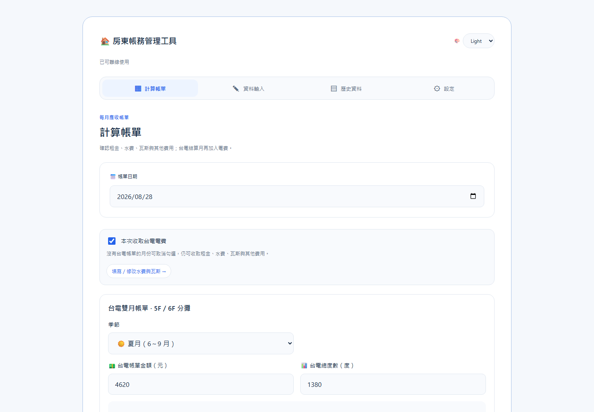
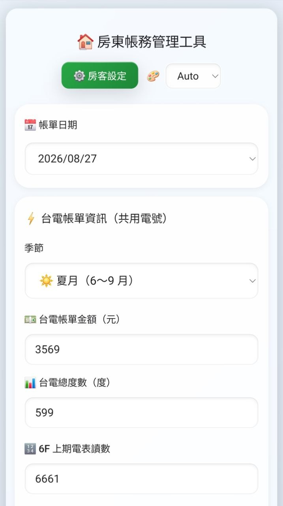
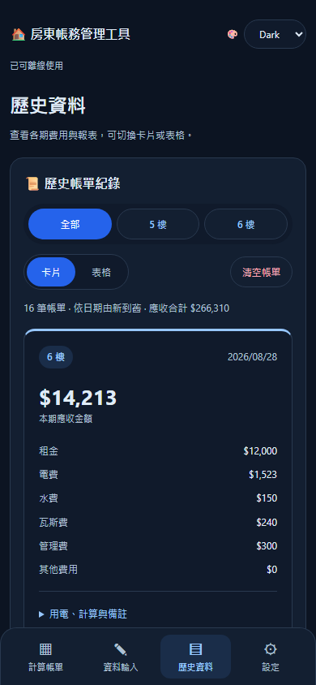

# 🏠 房東帳務管理工具


專為台灣包租代管房東打造的輕量化帳務管理工具。支援**共用台電電號的多戶累進電費分攤**，自動按比例計算各戶應付電費，水費依居住人數分攤，一鍵產出 LINE 報表。

## 🌟 核心功能

### ⚡ 台電累進電費分攤

- 共用電號（5F + 6F）輸入一次台電帳單，自動計算兩戶各自應付電費
- 採用**累進費率理論電費 + 差額按用電比例分攤**的計算方式
- 5F 用電量 = 台電該期總度數 − 6F 兩筆配對讀數的差（不需要 5F 獨立電表）
- 台電每兩個月一期；6F 可依實際日期抄表，結算時按台電區間配對，預設搜尋起訖日前後 3 天
- 支援夏月／非夏月費率切換

### 💧 水費按人數分攤

- 輸入水費總額，自動依各戶居住人數比例分攤
- 人數設定長期記憶，不需每月重填

### 🏠 多戶獨立帳單

- 5F、6F 各自獨立存檔，歷史記錄可按樓層篩選
- 各戶獨立設定：租金、銀行收款資訊、固定備註、房東私用備註
- 每張帳單各自填寫當期備註，存檔時保存當時的固定備註
- 各戶獨立的瓦斯費、管理費、其他費用輸入

### 📋 LINE 報表

- 一鍵產出含電費分攤說明的透明化 LINE 報表
- 固定備註與當期備註分段顯示，房東私用備註不出現在租客報表

### 💾 資料管理

- 帳務資料儲存在使用者瀏覽器的 localStorage，不上傳伺服器
- 支援 CSV 匯出備份與匯入還原，並相容舊 JSON 備份
- 輸入值自動記憶，下次開啟不需重填

備份檔為 UTF-8 CSV（含 BOM），使用中文欄名，可用試算表閱讀。「資料類型」區分房客設定、逐筆帳單、抄表清單與抄表紀錄；檔案包含收款資訊、備註、各項費用、電表讀數與分攤明細。尚未存檔的輸入與主題偏好不包含在備份內。

銀行代號、帳號、帳單編號與可能被試算表解讀成公式的文字，會加上單引號保護；本工具匯入時會還原。以 Excel 編輯時請將這些欄位保留為文字、維持完整欄名，並另存為 UTF-8 CSV。匯入會先驗證格式，確認後覆蓋現有帳單及備份內的房客設定；舊版 `.json` 備份仍可匯入。

### 📱 PWA 應用程式

- 支援安裝至 iPhone、iPad、Android 與桌面裝置
- 從主畫面圖示以獨立視窗開啟，使用體驗接近原生 App
- 首次成功載入後，可在沒有網路時繼續使用主要功能
- 支援情境式安裝提示：完成帳單存檔或再次造訪時才顯示，不干擾首次操作
- Android／Windows 可直接叫出系統安裝視窗，iPhone／iPad 則提供加入主畫面步驟

## 🌐 線上使用

**立即使用：** [https://bruce-yang-422.github.io/landlord-billing-manager/](https://bruce-yang-422.github.io/landlord-billing-manager/)



以上及下方截圖使用模擬資料，於 2026-09-08 從本機目前版本擷取。

[桌面完整畫面](./screenshots/app-desktop.png)

| 手機計算帳單（亮色） | 手機歷史資料（暗色） |
| --- | --- |
|  |  |

### 安裝到裝置

**iPhone／iPad（Safari）：**

1. 使用 Safari 開啟上方網址
2. 點擊「分享」
3. 選擇「加入主畫面」
4. 從主畫面的「房東帳務」圖示開啟

**Android（Chrome）：**

1. 使用 Chrome 開啟上方網址
2. 開啟瀏覽器選單
3. 選擇「安裝應用程式」或「加入主畫面」

**桌面版 Chrome／Edge：**

開啟上方網址後，點擊網址列右側的安裝圖示，或從瀏覽器選單選擇安裝。

符合安裝條件時，網站也會在完成帳單存檔後或第二次造訪時顯示安裝提示。選擇「稍後再說」後，30 天內不會再次主動提示。

也可使用頁面右上方的「📲 安裝 App」按鈕：支援原生安裝提示的瀏覽器會開啟安裝視窗，iPhone／iPad 會顯示加入主畫面教學。已安裝並以獨立視窗開啟時會隱藏按鈕。

頁面顯示「已可離線使用」後，即可斷網繼續記帳。新版下載完成會顯示通知；請先儲存帳單，再關閉所有本工具分頁與 App 視窗，重新開啟即可使用新版。

### 本機測試與發布 PWA

PWA 必須透過 HTTPS 或 `localhost` 使用；直接雙擊 `index.html` 無法啟用離線功能。

```sh
python -m http.server 8080 --bind 127.0.0.1
```

開啟 `http://localhost:8080`，等待「已可離線使用」，再於瀏覽器開發者工具切換離線並重新整理，確認計算、存檔與歷史紀錄仍可使用。

使用 Node.js 22 可執行自動化測試，涵蓋費用計算、抄表配對、CSV 相容性、備註、導覽與 PWA 快取：

```sh
node --test tests/*.test.cjs
```

發布時請一併上傳完整專案，並遞增 `service-worker.js` 的 `CACHE_NAME` 版本（目前 `v44`）。HTML、CSS、JS 採同版本預先快取；更新會等待舊版視窗全部關閉後才啟用。快取名稱包含部署路徑，避免同網域其他部署互相刪除快取。舊版 `v1`～`v3` 未包含部署路徑的快取會保留，避免刪除其他部署的資料。

> [!IMPORTANT]
> 帳務資料儲存在目前執行環境的 localStorage。iPhone／iPad 加入主畫面後，獨立 Web App 不一定會自動帶入 Safari 中既有的資料。若已在 Safari 使用本工具，請先匯出 CSV 備份，再從主畫面版本匯入。清除瀏覽器網站資料或移除相關網站資料也可能刪除帳務內容，請定期匯出備份。

## 📖 使用方式

### 首次設定（僅需一次）

1. 點擊導覽列的「設定」，進入獨立房客設定畫面
2. 分別填入 5F、6F 的租金、居住人數、銀行名稱、分行名稱、銀行代號、戶名與帳號
3. 在「備註」分頁填入固定備註（每期提供給租客）和房東備註（僅供記錄）
4. 點「💾 儲存房客設定」，自動返回計算帳單頁

### 收款資訊

「設定 → 各戶基本資料」依序提供以下欄位，5F、6F 可分別設定：

| 欄位 | 範例 |
| --- | --- |
| 銀行名稱 | 第一銀行 |
| 分行名稱 | 台北分行 |
| 銀行代號 | 007 |
| 戶名 | 王小明 |
| 帳號 | 001234567890 |

填妥後按「儲存房客設定」。銀行名稱、分行名稱與代號需自行填寫，沒有自動查詢對照；銀行代號與帳號以文字保存，保留開頭的 0。

有填寫帳號時，LINE 報表會列出收款資訊；未填的銀行名稱、分行名稱或代號不會顯示空白標籤。CSV 備份包含五個欄位。舊備份即使沒有銀行名稱或分行名稱仍可匯入，原有代號、戶名及帳號會保留。

CSV 匯出欄名統一為「銀行代號、戶名、帳號」，匯入亦接受舊欄名「銀行代碼、帳戶名稱、銀行帳號」。

### 手機 App 導覽

底部固定「計算帳單、資料輸入、歷史資料、房客儲值、設定」五個入口。每次只顯示一個畫面，支援瀏覽器上一頁；桌面版使用上方導覽，保留整頁外框。設定頁切換不會丟棄尚未儲存的表單內容，按「儲存房客設定」才會正式存檔。

### 6F 抄表（可使用不固定間隔）

1. 開啟「資料輸入」，選擇抄表日期。
2. 輸入這次電表的累計讀數，上期會依日期自動取最近一筆較早的歷史讀數。
3. 檢查本次用電量，點「儲存本次抄表」。不需要輸入台電帳單。
4. 沒有歷史資料時，先補登一筆起始日期與讀數。可在資料輸入頁編輯或刪除獨立抄表紀錄。

舊 6F 帳單中的**本期**讀數也會作為歷史來源；同日期優先使用獨立抄表資料。零用電可以儲存，補登／修改的讀數必須介於前後紀錄之間。換表或讀數歸零尚不支援，請勿直接填入比上期小的讀數。

### 其他費用內容（選填）

在「資料輸入」各樓層的其他費用金額下方，可填寫內容，例如「更換門鎖」或「清潔費」，留空也能存檔。內容按樓層自動記憶，與其他費用金額一起沿用，下期收費前請核對。每張帳單保存當時的內容，後續修改輸入不影響歷史帳單。

計算預覽、歷史明細、LINE 報表、待抵扣項目及已抵扣雜費明細會顯示內容。CSV 備份新增「其他費用內容」欄，舊備份沒有此欄仍可匯入。

### 每月水費、瓦斯與租金

「資料輸入」除了 6F 抄表，也包含水費總額與兩戶各自的瓦斯費、管理費、其他費用。水費依設定的人數分攤；其餘費用直接歸入各戶，輸入會自動記憶。每次收費請核對金額，未收取的項目填 0。

到「計算帳單」可逐項查看租金、水費、瓦斯、電費與應收總額。沒有台電帳單的月份，取消「本次收取台電電費」即可存檔一般月帳單，不需填電費或起訖讀數。此選擇會記憶，台電結算月請重新勾選。

### 水電費儲值（獨立於租金）

「設定 → 各戶基本資料」提供「啟用儲值功能」獨立開關，例如可關閉 5 樓、保留 6 樓。按「儲存房客設定」後生效；停用後不新增儲值、不抵扣新舊帳單，計算頁隱藏該戶抵扣選項。停用樓層不出現在房客儲值頁的卡片、選單、待抵扣與明細中；既有餘額、已抵扣金額及紀錄保留，重新開啟後恢復顯示及使用。全部停用時顯示前往設定的提示。CSV 的「儲值功能啟用」保存 true／false；沒有開關設定的既有資料預設啟用。


計算帳單的各樓層卡片，以及「房客儲值 → 待抵扣費用」，均可勾選電費、水費、瓦斯費、管理費、雜費／其他。全不勾選即不扣款。餘額不足時，依上述順序抵扣已勾選項目；未勾選費用照常應收。新帳單的勾選會在瀏覽器記憶，既有帳單則每次操作重新選擇。

帳單、LINE 報表與儲值明細保存每個項目的實際抵扣金額，CSV 另含「電費抵扣、水費抵扣、瓦斯費抵扣、管理費抵扣、雜費抵扣」五欄。舊備份只有水電合計抵扣時，沿用總額並按電費優先、水費其次分配供後續計算，不會再扣一次。CSV 的「水電儲值抵扣」舊欄名保留相容性，現在代表全部項目的抵扣總額。


導覽列的「房客儲值」集中提供各戶可用餘額、累計儲值、已抵扣總額、登記儲值與待抵扣帳單。下方明細可按樓層及「儲值／費用抵扣」篩選，儲值顯示正額、抵扣顯示負額，並可查看對應帳單與備註。抵扣依帳單日期排序，每張帳單顯示累計抵扣，並非逐次扣款時間紀錄。樓層篩選也適用於待抵扣帳單；上方餘額卡片顯示所有已啟用樓層總額。


在「房客儲值 → 登記儲值」選擇 6 樓、實際收款日期，輸入 **3000**，按「登記水電費儲值」。各樓層分開保存儲值紀錄、備註與餘額。

帳單預設勾選電費與水費，存檔才實際扣款；租金不提供抵扣；瓦斯、管理費、雜費需額外勾選。餘額不足時，只將未抵扣水電費加入應收總額。例如預付 3,000 元、本期水電 800 元，扣款後剩 2,200 元，租金照原額收取。補登舊日期帳單也按存檔當下餘額扣款。

若先開帳單才收到儲值，可在「歷史資料」對該筆帳單按「選擇抵扣項目」前往房客儲值頁勾選費用，確認水電費尚未另行收款後套用。系統只抵扣勾選項目尚未抵扣的部分，餘額不足可在下次儲值後繼續抵扣；不會新增帳單或改動原本水電費。

預覽、歷史帳單及 LINE 報表顯示抵扣金額，報表保留存檔時餘額。刪除帳單會返還抵扣；清空帳單會返還全部抵扣並保留儲值紀錄。誤登儲值可在「房客儲值 → 儲值與抵扣明細」刪除，但不能使餘額小於零，已使用的儲值須先刪除相關帳單。

CSV 備份包含儲值清單與帳單抵扣。匯入會覆蓋儲值；舊備份沒有儲值資料時會清空儲值，以免與還原帳單重複計算。請先匯出完整備份。儲值資料存於 `landlord_utility_deposits`，餘額由儲值總額減去已存帳單抵扣計算。

### 台電每兩個月結算（5F／6F）

1. 開啟「計算帳單」，確認帳單日期與季節。
2. 輸入台電帳單金額與總度數。
3. 填寫台電帳單的用電起訖日期（獨立於帳單日期），系統預設在各端點前後 3 天內選最近的抄表（若曾調整，會沿用此瀏覽器記住的天數），同距離取較早日期。搜尋天數可設為 0～31 天，0 表示只採用同日紀錄。可手動改選範圍內紀錄，或按「重新自動配對」。日期不符會顯示提醒，請核對實際抄表區間；6F 使用兩筆累計讀數差，不按天數插值或推估。
4. 6F 同期間用電＝結束讀數－起始讀數；5F 用電＝台電總度數－6F 同期間用電。
5. 到「資料輸入」填入水費總額、各戶瓦斯費、管理費與其他費用，再回「計算帳單」核對各戶應收總額並儲存。儲存後會前往「歷史資料」頁，查看歷史帳單與複製 LINE 報表。此頁提供樓層篩選與刪除帳單；CSV 匯出及資料匯入位於「設定 → 備份與還原」，匯出包含所有樓層帳單、房客設定及抄表紀錄。

例如 7/8 讀數 1000、8/8 為 1120、9/8 為 1300，7/8～9/8 結算的 6F 用電為 **300 度**，不是最近一個月的 180 度。沒有足夠紀錄時需補登起訖讀數，系統不會自動將一個月用電當成兩個月。租金仍使用房客設定中的每筆租金，抄表不會自動產生月租帳單。

### 歷史資料：卡片／表格

到「歷史資料」查看已存帳單，可篩選全部、5 樓或 6 樓，依日期由新到舊排列，並顯示目前篩選結果的筆數與應收合計。

- **卡片模式**：手機單欄、桌面雙欄，顯示總額及租金、電費、水費、瓦斯費、管理費、其他費用。
- **表格模式**：各項費用並列，方便跨期比較；窄螢幕可左右滑動。
- 兩種模式都可展開「用電、計算與備註」，查看台電區間、實際抄表日期、讀數、分攤依據與帳單備註。
- 點「查看／複製報表」顯示 LINE 報表，再點「複製報表」。可逐筆刪除或清空所有帳單；清空不受樓層篩選限制，獨立抄表仍保留。

顯示模式會在此瀏覽器記憶。操作按鈕採膠囊式，卡片／表格切換與清空帳單放在同一列；深淺色主題都以深藍底白字標示選中模式。

### 固定與當期備註

| 類型 | 填寫位置 | 用途與保存方式 |
| --- | --- | --- |
| 固定備註 | 設定 → 各戶備註 | 每期提供給租客；新帳單保存存檔當時的文字 |
| 房東備註 | 設定 → 各戶備註 | 私用紀錄，不放入租客 LINE 報表；會包含在完整 CSV 備份中 |
| 當期備註 | 計算帳單 → 各戶存檔按鈕上方 | 僅屬於該張帳單，例如本期維修費說明；會提供給租客 |

當期備註按 5F、6F 分開。未存檔的文字會在此瀏覽器記憶；成功存檔後清空該戶文字，變更帳單日期時清空兩戶文字，儲存失敗則保留。

歷史明細、LINE 報表與 CSV 保留新帳單的固定與當期備註。修改設定不會改寫新帳單已保存的備註；舊帳單沒有固定備註快照時，報表沿用目前設定。

### CSV 資料驗證ID

匯出 CSV 時，每筆資料（含房客設定、帳單、抄表、儲值及清單標記）會附上「資料驗證ID」：SHA-256 雜湊前 20 碼大寫十六進位字元。相同內容產生相同驗證值；原本的帳單編號仍保留。

演算法將該列除驗證ID之外的「欄名、儲存格文字」配對，依欄名排序，轉為 JSON，再以 UTF-8 計算 SHA-256。CSV 引號、檔案 BOM、列與列之間的換行及欄位順序不影響結果；儲存格內的文字、數字格式、空白與換行會影響結果。

匯入含此欄位的 CSV 時，每列都必須驗證成功，空白或不符會中止匯入並指出資料筆次。請在程式中更新帳務後重新匯出；直接編輯 CSV 內容會使原驗證值失效。沒有此欄位的舊 CSV 與 JSON 仍可匯入，下次匯出 CSV 會補上驗證值。

這是內容一致性檢查，並非身分認證或數位簽章，也不保證 ID 絕不重複；不會驗證資料列是否遭刪除。

### 備份與相容性

1. 前往「設定 → 備份與還原」。
2. 點「備份／匯出 CSV」下載所有樓層帳單、房客設定與抄表紀錄，不受歷史樓層篩選影響。
3. 點「匯入資料」選取本工具的 CSV 或舊 JSON，核對確認訊息後還原。

匯入會覆蓋對應的現有資料與備份內的房客設定，請先匯出目前資料。尚未存檔的輸入、顯示模式及主題偏好不在備份內。

CSV 備份包含每月抄表清單、台電用電區間與實際起訖抄表日期，也能還原空抄表清單。舊版 31／33／35 欄 CSV 與 JSON 仍可匯入；未包含抄表清單的舊備份會保留本機獨立抄表資料。修改抄表不會回頭改寫已存檔帳單；清空帳單也不會清空獨立抄表紀錄。

## ⚡ 電費分攤計算說明

本工具採用**累進理論費用 + 差額分攤**方式，費率常數位於 `js/data.js`：

```text
1. 分別計算 5F、6F 若獨立計費的理論電費（C5理、C6理）
2. 累進差額 ΔC = 台電帳單 − (C5理 + C6理)
3. 各戶分攤差額 = ΔC × (本戶度數 / 總度數)
4. 各戶應付 = 理論電費 + 分攤差額
5. 確保 5F + 6F = 台電帳單（四捨五入誤差由 6F 吸收）
```

此計算會使兩戶電費合計等於輸入的台電帳單金額，但各戶平均單價可能不同。工具未自動驗證各戶單價上限，不應將分攤結果視為合規保證。台電金額、度數及抄表日期仍需由使用者核對。

## 📁 檔案結構

```text
landlord-billing-manager/
├── css/
│   ├── style.css       # 基礎版面與響應式排版
│   └── flat.css        # Logo 寶藍與暖白卡片風格，支援亮色/暗色/Auto 主題
├── icons/
│   ├── icon.ico                 # 瀏覽器分頁圖示
│   ├── icon-192.png             # PWA 一般圖示（192×192）
│   ├── icon-512.png             # PWA 一般圖示（512×512）
│   ├── icon-maskable-192.png    # PWA 可遮罩圖示（192×192）
│   └── icon-maskable-512.png    # PWA 可遮罩圖示（512×512）
├── js/
│   ├── data.js         # 台電費率常數、appData 全域狀態
│   ├── units.js        # 房客設定讀寫（租金、人數、銀行資訊）
│   ├── calculation.js  # 累進分攤、水費分攤計算邏輯
│   ├── csv.js          # 中文欄位 CSV 編碼、解析與備份驗證
│   ├── storage.js      # 帳單 CRUD、匯入匯出、輸入記憶
│   ├── ui.js           # 即時預覽、LINE 報表、歷史記錄
│   ├── theme.js        # 主題切換（亮色/暗色/Auto）
│   ├── pwa-install.js  # 跨平台安裝提示與 iOS 加入主畫面教學
│   ├── pwa.js          # Service Worker 註冊、離線與更新狀態
│   ├── meter.js        # 每月抄表、歷史讀數與雙月起訖選擇
│   ├── navigation.js   # 五個獨立畫面與手機底部導覽
│   └── app.js          # 初始化入口
├── tests/                       # 費用、CSV、抄表、導覽與 PWA 測試
├── screenshots/
│   ├── app-desktop-wide.png     # 桌面版計算帳單預覽
│   ├── app-desktop.png          # 桌面版完整頁面截圖
│   ├── app-mobile.jpg           # 手機版計算帳單（亮色）
│   └── app-mobile-history-dark.png # 手機歷史資料（暗色）
├── index.html                   # 主頁面與 PWA 介面
├── manifest.webmanifest         # PWA 名稱、配色與圖示設定
└── service-worker.js            # 離線快取與版本更新
```

## 📦 資料結構（localStorage）

**房客設定**（`landlord_units`）：

```json
[
  {
    "id": "5F", "label": "5 樓",
    "rent": 15000, "persons": 2,
    "bankName": "第一銀行", "branchName": "台北分行", "bankCode": "007", "payeeName": "王小明", "accountNumber": "1234567890",
    "tenantNote": "請於每月5日前匯款", "landlordNote": "押金2個月"
  },
  { "id": "6F", "label": "6 樓", "rent": 12000, "persons": 1 }
]
```

**帳單記錄**（`landlord_billing_db`）：

```json
[
  {
    "id": 1234567890,
    "unitId": "6F",
    "date": "2026-06-01",
    "rent": 12000,
    "electricity": {
      "fee": 500, "usage": 200, "prevReading": 1200, "currReading": 1400,
      "season": "other",
      "periodStart": "2026-04-01", "periodEnd": "2026-06-01",
      "prevDate": "2026-04-02", "currDate": "2026-05-30"
    },
    "tenantNote": "請於每月5日前匯款",
    "currentNote": "本期瓦斯費未收取",
    "waterFee": 400,
    "gasFee": 0, "managementFee": 0, "otherFee": 0,
    "total": 12900,
    "splitInfo": {
      "totalBill": 1000, "totalUnits": 400,
      "e5": 200, "e6": 200, "ratio5": 0.5, "ratio6": 0.5,
      "c5Theory": 356, "c6Theory": 356, "deltaC": 288
    }
  }
]
```

帳單中的 `tenantNote` 為固定備註快照，`currentNote` 為當期備註。CSV 沿用「租客備註」欄保存固定備註，並以「當期備註」欄保存單張帳單文字。

**獨立抄表**（`landlord_meter_readings`）：

```json
[
  { "id": 2001, "date": "2026-04-02", "reading": 1200 },
  { "id": 2002, "date": "2026-05-30", "reading": 1400 }
]
```

`landlord_billing_inputs` 保存未存檔的表單內容（包含搜尋天數與當期備註）；`landlord_history_view` 保存卡片／表格偏好。這些不是已存帳單，不包含在 CSV 備份中。

## 授權

[MIT License](./LICENSE)
